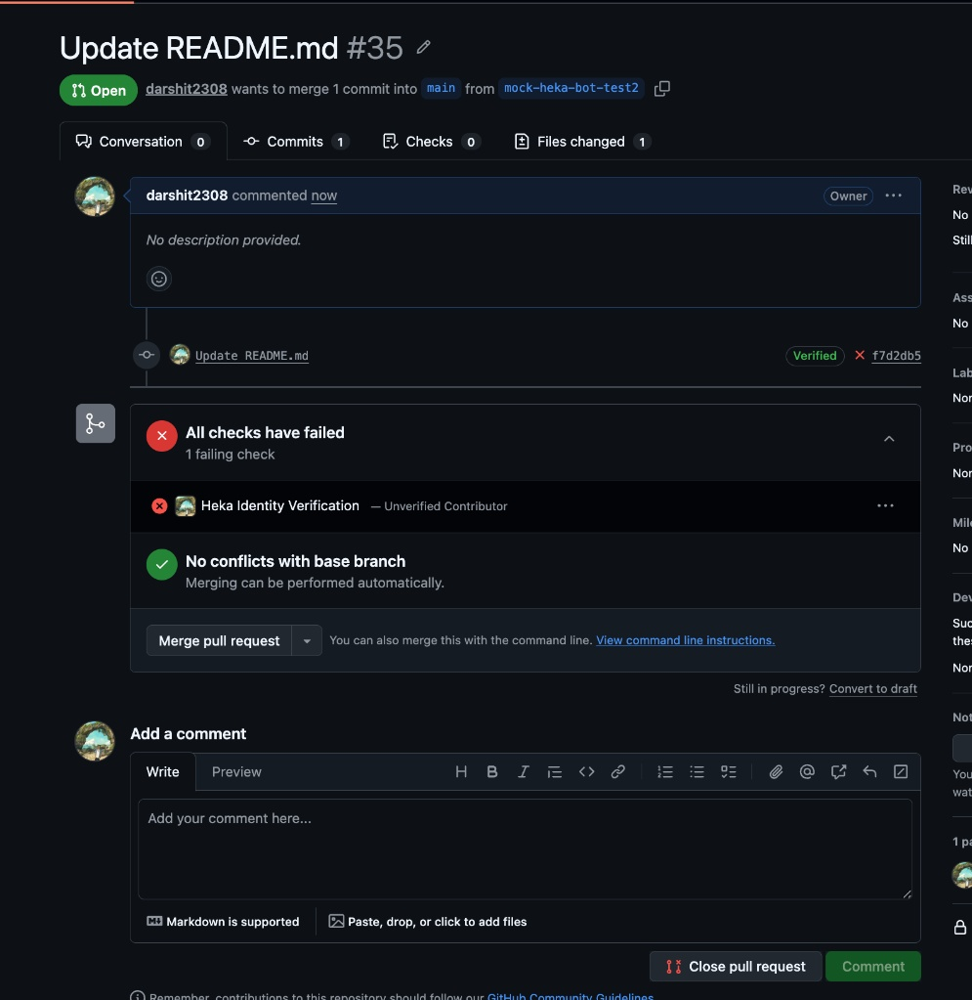
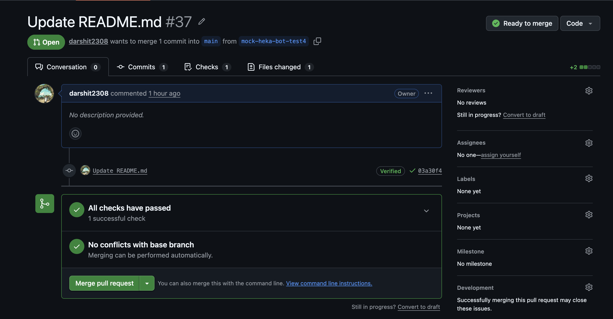

# 🔐 Heka Identity Prototype

### Decentralized Contributor Identity Verification for Open Source

_A working prototype built for the [LF Decentralized Trust Mentorship Program — Issue #87](https://github.com/LF-Decentralized-Trust-Mentorships/mentorship-program/issues/87)_

---


<br/>

> **"Every commit tells a story. But who is really telling it?"**
>
> This prototype answers that question — cryptographically.

</div>

---

## 📖 The Problem

Open source contribution platforms like GitHub rely on email addresses and usernames for contributor attribution. This trust model has three fundamental weaknesses:

| Weakness                | Reality                                                                                           |
| ----------------------- | ------------------------------------------------------------------------------------------------- |
| **Identity Spoofing**   | Anyone can set `git config user.email linus@kernel.org` and commit as Linus Torvalds              |
| **Fragmented Identity** | A contributor's reputation is siloed per-platform with no portable proof                          |
| **Agentic AI Flooding** | AI agents can now impersonate developers and flood repositories with low-quality or malicious PRs |

These risks are not hypothetical. As open source becomes critical infrastructure, the integrity of who contributes what becomes a security concern — not just a social one.

---

## 💡 The Solution

**Heka Identity Prototype** implements a decentralized trust layer on top of GitHub's existing workflow using:

- **GPG Cryptographic Proof** — contributor proves ownership of their GitHub GPG key by signing a server-issued nonce. The private key never leaves their machine.
- **Decentralized Identifiers (DIDs)** — a globally unique, cryptographically verifiable identity anchor owned by the contributor, not a platform
- **W3C Verifiable Credentials (VCs)** — a tamper-proof, digitally signed certificate issued by a trusted authority (the Heka Issuer)
- **GitHub Checks API** — native PR-level enforcement that blocks unverified contributors automatically

When a contributor opens a Pull Request, the system doesn't ask _"who does GitHub think you are?"_ — it asks _"can you prove it cryptographically?"_

---

## 🎯 Implemented Features (MVP)

| Feature                        | Status  | Description                                                                                               |
| ------------------------------ | ------- | --------------------------------------------------------------------------------------------------------- |
| **React Onboarding Console**   | ✅ Live | Modern web UI replacing terminal CURL commands for contributor onboarding                                 |
| **GPG Challenge-Response**     | ✅ Live | Cryptographic proof of GitHub GPG key ownership before VC issuance — private key never leaves the machine |
| **SQLite Persistent Storage**  | ✅ Live | Challenges, credentials, and identities survive server restarts using a lightweight embedded database     |
| **GitHub App (Probot)**        | ✅ Live | Intercepts PR events and blocks unverified contributors automatically based on SQLite credential state    |
| **W3C Verifiable Credentials** | ✅ Live | Tamper-proof, digitally signed identity certificates issued by the Heka Issuer                            |
| **Decentralized Identifiers**  | ✅ Live | Self-sovereign DIDs (`did:key`) for portable, platform-independent identity anchors                       |
| **Credo-ts Integration**       | ✅ Live | Production-grade identity framework compatible with Heka Identity Platform                                |

---

## 🏗️ Architecture

```
┌──────────────────────────────────────────────────────────────────────┐
│                       HEKA IDENTITY SYSTEM                           │
│                                                                      │
│   ┌──────────────┐  GET /challenge  ┌─────────────────────────────┐  │
│   │              │ ───────────────▶ │                             │  │
│   │  Contributor │   { nonce }      │   mock-heka-credo           │  │
│   │   (GitHub)   │ ◀─────────────── │   (Identity Service)        │  │
│   │              │                  │                             │  │
│   │  [signs with │  POST /onboard   │   • Credo-ts Agent          │  │
│   │   GPG key]   │ ───────────────▶ │   • Askar Wallet            │  │
│   │              │  VC + DID issued │   • GPG sign/verify         │  │
│   │              │ ◀─────────────── │   • did:key creation        │  │
│   └──────┬───────┘                  │   • W3C VC issuance         │  │
│          │                          │   • JWT signing (EdDSA)     │  │
│          │ Opens Pull Request       │   • /verify endpoint        │  │
│          ▼                          └──────────────┬──────────────┘  │
│   ┌──────────────┐  webhook event                  │                 │
│   │              │ ──────────────▶ ┌───────────────┴──────────────┐  │
│   │    GitHub    │                 │        mock-heka-bot          │  │
│   │  Repository  │                 │        (Probot App)           │  │
│   │              │ ◀────────────── │  POST /verify → isValid?      │  │
│   └──────────────┘  ✅ / ❌ Check  └──────────────────────────────┘  │
│                                                                      │
└──────────────────────────────────────────────────────────────────────┘


                     CRYPTOGRAPHIC TRUST FLOW
                     ──────────────────────────
  GitHub GPG Key ──proves──▶ Ownership ──unlocks──▶ VC Issuance
  Issuer DID     ──signs───▶ VC        ──stored──▶  Wallet
  GitHub App     ──verifies─▶ VC       ──posts───▶  PR Check
```


### Component Breakdown

| Component         | Technology                   | Role                                                          |
| ----------------- | ---------------------------- | ------------------------------------------------------------- |
| `mock-heka-credo` | Node.js + Credo-ts + Express | Identity Issuer — GPG verification, DID creation, VC issuance |
| `mock-heka-bot`   | Probot + TypeScript          | GitHub App — webhook listener, PR enforcement                 |
| Askar Wallet      | `@hyperledger/aries-askar`   | Secure key management and cryptographic operations            |
| DID Method        | `did:key` (Ed25519)          | Portable, self-sovereign decentralized identifier             |
| Credential Format | W3C VC / JWT (`jwt_vc`)      | Tamper-proof signed identity certificate                      |
| GPG Auth          | OpenPGP.js                   | Cryptographic proof of GitHub key ownership                   |
| Webhook Tunnel    | Smee.io                      | Routes GitHub webhook events to local development server      |

---

## 🔄 Flow Diagrams

### Flow 1 — Contributor Onboarding (GPG Ownership Proof)

```
Contributor                      Heka Identity Service
    │                                     │
    │  GET /challenge/:username           │
    │ ───────────────────────────────────▶│
    │                                     │── Fetch GPG public key from
    │                                     │   github.com/:username.gpg
    │                                     │── Validate user + key exists
    │                                     │── Generate random nonce
    │                                     │── Store nonce (5 min expiry)
    │  { challenge: "a3f9...", cmd }       │
    │ ◀───────────────────────────────────│
    │                                     │
    │  [runs: echo "a3f9..." | gpg --clearsign]
    │  [private key signs the nonce locally]
    │  [private key NEVER leaves machine] │
    │                                     │
    │  POST /onboard                      │
    │  { github_username, signature }     │
    │ ───────────────────────────────────▶│
    │                                     │── Fetch public key from GitHub
    │                                     │── openpgp.verify(signature)
    │                                     │── Confirm signed text = nonce
    │                                     │── Create did:key DID
    │                                     │── Sign W3C VC (EdDSA/JWT)
    │                                     │── Store in Askar wallet
    │  { did, credential (JWT) }          │
    │ ◀───────────────────────────────────│
```


### Flow 2 — Pull Request Verification

#### Step 1: GitHub PR Webhook → Probot Bot


#### Step 2: Heka Service Verification → GitHub Check


---

## ✅ Live Demo

**Watch the latest demo here** → [https://www.youtube.com/watch?v=EVA5NBKnafA](https://www.youtube.com/watch?v=EVA5NBKnafA)

_This demo showcases the complete MVP including the React Web UI, GPG challenge-response flow, SQLite persistence, and GitHub App enforcement._

The following screenshots show the system running end-to-end on a real GitHub repository.

### Unverified Contributor — PR Blocked ❌

> A PR opened by a contributor who has not onboarded with Heka receives an automatic failure check.



### Verified Contributor — PR Approved ✅

> After onboarding with GPG proof, the contributor's DID appears in the PR check summary.



---

## 🖼️ Visual Assets & Screenshots

### React Web UI Console

This screenshot shows the onboarding interface used to submit a GPG signature and receive DID/VC output.


---

### SQLite Schema Diagram

This diagram shows how onboarding challenges and issued identities are persisted in SQLite.


---

### Component Interaction Diagram

This flow shows request and verification movement between UI, issuer service, wallet, database, bot, and GitHub.


---

### Cryptographic Verification Flow

This flow visualizes how GPG proof is transformed into a signed verifiable credential used for PR enforcement.


---

## 🚀 Getting Started

### Prerequisites

| Requirement    | Version                                                                                                                                                                  |
| -------------- | ------------------------------------------------------------------------------------------------------------------------------------------------------------------------ |
| Node.js        | **v20.x LTS only** (v18.x also works — v21+ is NOT supported due to native Askar bindings)                                                                               |
| npm            | v9+                                                                                                                                                                      |
| GPG Key        | Must be added to your GitHub account ([guide](https://docs.github.com/en/authentication/managing-commit-signature-verification/adding-a-gpg-key-to-your-github-account)) |
| GitHub Account | Required to install the GitHub App                                                                                                                                       |
| Smee.io        | Free — no account needed                                                                                                                                                 |

---

### Step 1 — Set Up the React Onboarding UI (`heka-web-ui`)

```bash
cd heka-web-ui
npm install
npm run dev
```

The React UI will start at `http://localhost:5173` and provides a modern alternative to the terminal-based onboarding flow. You can use this console to submit GPG signatures and receive credentials via a web interface.

---

### Step 2 — Set Up the Identity Service (`mock-heka-credo`)

```bash
cd mock-heka-credo
npm install
cp .env.example .env
```

Edit `.env`:

```env
PORT=3000
WALLET_ID=heka-issuer-wallet
WALLET_KEY=your-strong-wallet-passphrase-here
```

Start the service:

```bash
npm start
```

You should see:

```
🚀 Starting Mock Heka Identity Service...
✅ Credo agent initialised
🛡️  Wallet created and unlocked
📜 Issuer DID: did:key:z6Mk...
🌐 API running at http://localhost:3000
   GET  /status              — health check + issuer DID
   GET  /challenge/:username  — Step 1: get nonce to sign
   POST /onboard             — Step 2: submit GPG signature + receive VC
   POST /verify              — verify contributor (called by GitHub App)
```

---

### Step 3 — Set Up the GitHub App (`mock-heka-bot`)

```bash
cd ../mock-heka-bot
npm install
cp .env.example .env
```

Create a GitHub App:

1. Go to **GitHub → Settings → Developer Settings → GitHub Apps → New GitHub App**
2. Set the Webhook URL to your Smee.io channel (get one free at [smee.io](https://smee.io))
3. Set permissions: **Checks → Read & Write**, **Pull Requests → Read**
4. Subscribe to events: **Pull Request**
5. Download your private key

Edit `.env`:

```env
APP_ID=your_github_app_id
PRIVATE_KEY_PATH=./private-key.pem
WEBHOOK_SECRET=your_webhook_secret
WEBHOOK_PROXY_URL=https://smee.io/your-channel-id
HEKA_SERVICE_URL=http://localhost:3000
```

Start the bot:

```bash
npm start
```

---

### Step 4 — Onboard as a Verified Contributor (GPG Proof Flow)

This is the core of the system. You will prove ownership of your GitHub GPG key without ever sending your private key anywhere.

**4a — Request your challenge nonce:**

```bash
curl http://localhost:3000/challenge/YOUR_GITHUB_USERNAME
```

Response:

```json
{
  "message": "Sign this nonce using your GPG key and send the signature block to POST /onboard",
  "challenge": "8998b3d666a3301e7ac9b961eef73db3",
  "command_to_run": "echo \"8998b3d666a3301e7ac9b961eef73db3\" | gpg --clearsign"
}
```

**4b — Sign the nonce with your GPG private key:**

```bash
# Copy the exact nonce from the response (remove any backslashes)
echo "8998b3d666a3301e7ac9b961eef73db3" | gpg --clearsign > sig.txt
```

This produces a PGP signed message block in `sig.txt`. Your private key **never leaves your machine**.

**4c — Build the request payload:**

```bash
node -e '
  const fs = require("fs");
  const sig = fs.readFileSync("sig.txt", "utf8");
  fs.writeFileSync("payload.json", JSON.stringify({
    github_username: "YOUR_GITHUB_USERNAME",
    signature: sig
  }, null, 2));
'
```

**4d — Submit the proof and receive your Verifiable Credential:**

```bash
curl -X POST http://localhost:3000/onboard \
  -H "Content-Type: application/json" \
  -d @payload.json
```

Expected response:

```json
{
  "message": "Onboarding successful. Verifiable Credential issued.",
  "did": "did:key:z6Mk...",
  "credential": "eyJhbGciOiJFZERTQSJ9..."
}
```

The `credential` field is a signed JWT — a W3C Verifiable Credential cryptographically bound to your GitHub identity.

---

### Step 5 — Verify Your Credential

```bash
curl -X POST http://localhost:3000/verify \
  -H "Content-Type: application/json" \
  -d '{"github_username": "YOUR_GITHUB_USERNAME"}'
```

Expected response:

```json
{
  "status": "verified",
  "isValid": true,
  "did": "did:key:z6Mk..."
}
```

---

### Step 6 — Open a Pull Request

Open a PR on any repository where your GitHub App is installed. The **Heka Identity Verification** check will appear automatically within seconds — ✅ for onboarded contributors, ❌ for unregistered ones.

---

## 📁 Project Structure

```
heka-identity-prototype/
│
├── heka-web-ui/                  # React Onboarding Console
│   ├── src/
│   │   ├── App.tsx               # Main React component
│   │   ├── main.tsx              # Entry point
│   │   └── styles.css            # UI styling
│   ├── index.html
│   ├── package.json
│   ├── vite.config.ts            # Vite build configuration
│   └── tsconfig.json
│
├── mock-heka-credo/              # Identity Issuer Service
│   ├── src/
│   │   ├── index.ts              # Express server, agent setup, GPG verification
│   │   ├── database/
│   │   │   └── db.ts             # SQLite database initialization
│   │   ├── config/
│   │   │   └── env.ts            # Environment configuration
│   │   ├── handlers/
│   │   │   └── pullRequestHandler.ts
│   │   ├── services/
│   │   │   ├── hekaService.ts
│   │   │   ├── credentialService.ts
│   │   │   ├── gpgService.ts
│   │   │   └── identityService.ts
│   │   └── types/
│   │       └── verification.ts
│   ├── .env.example
│   ├── package.json
│   ├── tsconfig.json
│   └── vitest.config.ts
│
├── mock-heka-bot/                # GitHub Probot App
│   ├── src/
│   │   ├── index.ts              # Webhook handlers, GitHub Checks API
│   │   ├── config/
│   │   │   └── env.ts
│   │   ├── controllers/
│   │   │   ├── challengeController.ts
│   │   │   ├── onboardController.ts
│   │   │   ├── statusController.ts
│   │   │   └── verifyController.ts
│   │   │
│   ├── .env.example
│   └── package.json
│
└── README.md
```

---

## 🛠️ API Reference

### Identity Service (`mock-heka-credo`) — Port 3000

| Method | Endpoint               | Description                                                 |
| ------ | ---------------------- | ----------------------------------------------------------- |
| `GET`  | `/status`              | Health check — returns issuer DID                           |
| `GET`  | `/challenge/:username` | Step 1 — generate nonce for GPG signing                     |
| `POST` | `/onboard`             | Step 2 — verify GPG signature + issue Verifiable Credential |
| `POST` | `/verify`              | Cryptographically verify a contributor's credential         |

---

**`GET /challenge/:username`**

```bash
curl http://localhost:3000/challenge/darshit2308

# Response
{
  "message": "Sign this nonce using your GPG key...",
  "challenge": "8998b3d666a3301e7ac9b961eef73db3",
  "command_to_run": "echo \"8998b3d...\" | gpg --clearsign"
}
```

---

**`POST /onboard`**

```json
// Request
{
  "github_username": "darshit2308",
  "signature": "-----BEGIN PGP SIGNED MESSAGE-----\nHash: SHA256\n\n8998b3d...\n-----BEGIN PGP SIGNATURE-----\n..."
}

// Response
{
  "message": "Onboarding successful. Verifiable Credential issued.",
  "did": "did:key:z6MkrJ...",
  "credential": "<signed JWT>"
}
```

---

**`POST /verify`**

```json
// Request
{ "github_username": "darshit2308" }

// Response — verified
{ "status": "verified", "isValid": true, "did": "did:key:z6MkrJ..." }

// Response — not onboarded
{ "isValid": false, "error": "No credential found. Contributor needs to onboard first." }
```

---

## 🔬 Technical Deep Dive

### Why Credo-ts?

[Credo-ts](https://github.com/openwallet-foundation/credo-ts) (formerly Aries Framework JavaScript) is the OpenWallet Foundation's production-grade TypeScript framework for decentralized identity. It is the same framework used internally by the Heka Identity Platform — making this prototype architecturally compatible with the real system from day one.

### Why GPG Sign/Verify?

The sign/verify pattern is the industry standard for cryptographic proof of key ownership — the same mechanism used by SSH key authentication, code signing, and certificate issuance.

The security guarantee: the server fetches the contributor's public key directly from `github.com/:username.gpg` — the source of truth owned by GitHub itself. No user can fake this. The signature is verified against that key mathematically. This is unforgeable.

### Why `did:key`?

For the MVP, `did:key` was chosen because it is:

- **Self-contained** — no external ledger required to resolve
- **Immediately verifiable** — the public key is encoded directly in the DID
- **Production-compatible** — the system is architecturally designed to swap in `did:hedera` with minimal changes

In production, the DID will be anchored on the Hedera Testnet using the Hedera DID Method, providing immutable, publicly auditable identity records.

### Cryptographic Verification Chain

```
Contributor's GitHub GPG Key
         │
         ▼
Signs server nonce → Heka verifies ownership via openpgp
         │
         ▼
Heka creates Ed25519 keypair for contributor
         │
         ▼
Master Issuer DID (did:key:z6Mk[issuer-pubkey])
         │
         ▼
User DID created (did:key:z6Mk[user-pubkey])
         │
         ▼
W3C VC signed with issuer's Ed25519 private key
  {
    "@context": ["https://www.w3.org/2018/credentials/v1"],
    "type": ["VerifiableCredential", "GithubContributorCredential"],
    "issuer": "did:key:z6Mk[issuer]",
    "credentialSubject": {
      "id": "did:key:z6Mk[user]",
      "github_username": "darshit2308",
      "is_verified": true
    }
  }
         │
         ▼
JWT serialised and stored in Askar wallet
         │
         ▼
On /verify: Credo verifyCredential() checks EdDSA signature
against issuer's public key resolved from DID Document
```

---

## 🗺️ MVP vs Production

This prototype deliberately simplifies certain components to focus on proving the hardest architectural pieces first. Here is an honest breakdown:

| Feature              | MVP (This Prototype)                             | Production                                                     |
| -------------------- | ------------------------------------------------ | -------------------------------------------------------------- |
| **DID Method**       | `did:key` (local, no ledger)                     | `did:hedera` anchored on Hedera Testnet/Mainnet                |
| **Identity Storage** | ✅ SQLite registry for challenges and issued VCs | Persistent wallet-backed storage / registry model              |
| **Onboarding UI**    | ✅ **React Web Console**                         | GitHub OAuth-integrated contributor portal                     |
| **Onboarding Auth**  | ✅ GPG sign/verify challenge-response            | Same — plus key rotation, revocation, and wallet linkage       |
| **VC Format**        | W3C JWT VC                                       | SD-JWT VC for privacy-preserving presentation                  |
| **Wallet**           | Server-side Askar wallet for issuer keys only    | Contributor-owned cloud wallet with VC custody                 |
| **Verification**     | VC signature check through backend registry      | Linked VP from contributor wallet / DID Document               |
| **GitHub App**       | ✅ Checks API enforcement                        | Full status checks + PR comments + repo-specific configuration |

### What Is Not Done Yet

The items below are **not implemented in the current prototype**. They are the gap between the MVP I have now and the mentorship issue's longer-term target.

| Not Done Yet                     | Current State                                         | What the Mentorship Target Wants                                                   |
| -------------------------------- | ----------------------------------------------------- | ---------------------------------------------------------------------------------- |
| GitHub OAuth login               | Contributors do not sign in with GitHub through OAuth | A GitHub-authenticated onboarding entry point in the Heka Web UI                   |
| Contributor cloud wallet         | No contributor-owned wallet is created or managed     | Heka creates a cloud wallet for each contributor                                   |
| VC custody in contributor wallet | Credentials are stored server-side in SQLite          | VC is issued into the contributor wallet, not kept as the server’s source of truth |
| OID4VCI issuance flow            | Not implemented                                       | Standards-based credential issuance into the contributor wallet                    |
| OID4VP presentation flow         | Not implemented                                       | The contributor wallet presents a Verifiable Presentation to the verifier          |
| Linked VP in DID Document        | Not implemented                                       | A linked VP can be used to simplify verification                                   |
| Hedera DID anchoring             | Not implemented                                       | `did:hedera` anchored on Hedera Testnet/Mainnet                                    |
| SD-JWT VC format                 | Not implemented                                       | Privacy-preserving SD-JWT VC presentation                                          |
| VC revocation registry           | Not implemented                                       | A revocation mechanism for invalid or compromised credentials                      |
| Credential lifecycle management  | Not implemented                                       | Rotation, revocation, and lifecycle policies                                       |
| Repository-specific policies     | Not implemented                                       | Per-repository verification settings and enforcement controls                      |
| Warn-only mode                   | Not implemented                                       | Maintainable policy modes such as warn-only vs blocking                            |
| Production admin dashboard       | Not implemented                                       | Full OAuth-backed admin and contributor dashboard                                  |
| Self-sovereign wallet custody    | Not implemented                                       | Contributor-controlled identity and credential custody                             |

---

## 🚧 Explicit Prototype Boundaries

To avoid any ambiguity, this repository currently proves the following only:

1. A contributor can request a nonce from the backend.
2. The contributor can sign that nonce with a GitHub-linked GPG key.
3. The backend can verify the signature.
4. The backend can issue a Verifiable Credential.
5. The backend can store and later re-read that credential from SQLite.
6. The GitHub App can verify that stored credential and post a PR check result.

It does **not** yet prove the mentorship target's full self-sovereign wallet model. In particular, it does not yet:

1. Log the contributor in with GitHub OAuth.
2. Create a contributor-owned cloud wallet.
3. Issue the VC directly into that wallet.
4. Use OID4VCI or OID4VP end to end.
5. Use `did:hedera` for issuer / contributor DIDs.
6. Use a linked VP flow for pull request verification.
7. Provide revocation, rotation, or repository-level policy configuration.

---

## 🔭 Next Priority: `did:hedera` Mainnet Integration

The following roadmap items represent the next phase of development beyond the current MVP. They are intentionally **not done yet** in this repository:

1. **`did:hedera` Testnet Anchor** (🎯 **Next Major Milestone**)
   - Replace `did:key` with `did:hedera` using `@hashgraph/did-sdk`
   - Anchor both issuer and user DIDs on Hedera Testnet for public auditability and immutability
   - Integrate with Hedera's DID Method specification for production readiness

2. **SD-JWT Selective Disclosure**
   - Contributors can prove specific claims without revealing full identity profile
   - Enables privacy-preserving credential presentation

3. **VP Presentation Flow**
   - Full Verifiable Presentation layer where the contributor's wallet presents a VP to the verifier directly
   - Implements Options 1/2 from [Issue #87](https://github.com/LF-Decentralized-Trust-Mentorships/mentorship-program/issues/87) sequence diagrams

4. **VC Revocation Registry**
   - Mechanism to invalidate credentials when a contributor's account is compromised
   - Maintains trust in the verification system over time

5. **Repository-Specific Configuration**
   - Allow repo maintainers to set verification strictness (warn-only vs. blocking, grace periods for new contributors)
   - Enable customizable enforcement policies per repository

6. **Key Rotation and Revocation**
   - Implement GPG key rotation handling
   - Support credential lifecycle management

---

## 🤝 Relation to LFDT and Hiero

This prototype is built as a pre-application MVP for the **LF Decentralized Trust Mentorship Program (LFDT-2026)**, specifically [Issue #87 — Hiero: Contributor Identity Verification Prototype](https://github.com/LF-Decentralized-Trust-Mentorships/mentorship-program/issues/87).

The architecture is designed to integrate with:

- **Heka Identity Platform** — the existing Hiero identity ecosystem (Credo-ts is used internally by Heka)
- **Identity Collaboration Hub** — the prototype can be tested against real Hiero repositories
- **OpenVTC LFDT Lab** — the decentralized trust graph initiative for Linux Kernel contribution flow

This project serves as a reference implementation demonstrating that decentralized identity verification in open-source workflows is not just theoretically sound — it is practically buildable today.

---

## 👨‍💻 Author

**Darshit Khandelwal**

- GitHub: [@darshit2308](https://github.com/darshit2308)
- LinkedIn: [darshit-khandelwal](https://www.linkedin.com/in/darshit-khandelwal-49bb25288)
- Built as part of the LFDT Mentorship Program application — 2026

---

## 📄 License

This project is licensed under the Apache License 2.0 — see the [LICENSE](LICENSE) file for details.

---

<div align="center">

_Built with 🔐 cryptography, ☕ coffee, and a deep belief that open source deserves better identity infrastructure._

</div>
